## ✅ **Voici ton README CORRIGÉ avec les définitions sous chaque image**

```markdown
# 🏷️ Price Intelligence Platform

[](https://www.python.org/)
[](https://fastapi.tiangolo.com/)
[](https://reactjs.org/)
[](https://www.docker.com/)
[](LICENSE)


> Plateforme complète de surveillance et d'analyse des prix e-commerce au Maroc, intégrant scraping web, streaming temps réel, transformation de données, et dashboard interactif.

---

## 📋 Table des matières

1. [Vue d'ensemble](#-vue-densemble)
2. [Architecture du projet](#-architecture-du-projet)
3. [Structure des répertoires](#-structure-des-répertoires)
4. [Stack technologique](#-stack-technologique)
5. [Sources de données](#-sources-de-données)
6. [Pipeline de données](#-pipeline-de-données)
7. [Modèles dbt](#-modèles-dbt)
8. [API REST](#-api-rest)
9. [Dashboard](#-dashboard)
10. [Infrastructure & Déploiement](#-infrastructure--déploiement)
11. [Monitoring](#-monitoring)
12. [CI/CD](#-cicd)
13. [Démarrage rapide](#-démarrage-rapide)

---

## 🔍 Vue d'ensemble

La **Price Intelligence Platform** est un système de données end-to-end conçu pour collecter, traiter et analyser les prix de produits électroniques et vestimentaires sur les principales plateformes e-commerce marocaines. Elle permet de :

- **Scraper** automatiquement les catalogues de Jumia, Marjane, Micromagma et Zara
- **Streamer** les données brutes vers Apache Kafka en temps réel
- **Transformer** et nettoyer les données via dbt sur Google BigQuery
- **Orchestrer** les pipelines avec Apache Airflow
- **Visualiser** les tendances prix via un dashboard React + API FastAPI
- **Alerter** sur les baisses de prix significatives

---

## 🏗️ Architecture du projet

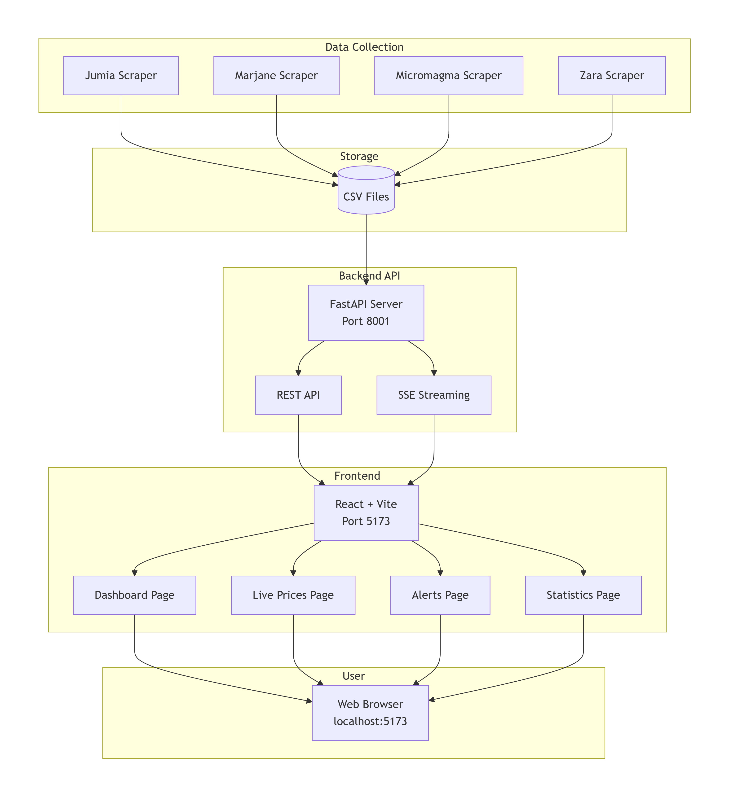

> *Schéma de l'architecture du projet (pipeline complet)*

Le projet suit une architecture full stack moderne avec une séparation claire entre la couche data (scraping, streaming, transformation) et la couche application (API, frontend). Les données traversent un pipeline allant des scrapers vers Kafka, NiFi, BigQuery, puis dbt, avant d'être exposées via FastAPI et affichées dans un dashboard React.

---

## 📁 Structure des répertoires

```
price-intelligence-platform/
│
├── scrapers/                          # Collecte de données
│   ├── scraper/
│   │   ├── spiders/
│   │   │   ├── jumia_spider.py        # Spider Scrapy — Jumia.ma
│   │   │   ├── micromagma_spider.py   # Spider Scrapy — Micromagma.ma
│   │   │   ├── zara_spider.py         # Spider Scrapy — Zara.com/ma
│   │   │   └── dynamic_spider.py      # Spider générique
│   │   ├── items.py
│   │   ├── pipelines.py
│   │   ├── middlewares.py
│   │   └── settings.py
│   ├── scrape_marjane.py
│   ├── send_to_kafka.py
│   ├── send_to_nifi.py
│   ├── kafka_consumer_to_bigquery.py
│   ├── kafka_consumer_to_csv.py
│   ├── Dockerfile
│   ├── requirements.txt
│   └── data/
│       ├── cleaned_prices.csv
│       ├── price_history.csv
│       ├── price_alerts.csv
│       ├── daily_prices_dashboard.csv
│       ├── brand_stats.csv
│       └── clean_summary_stats.csv
│
├── airflow/                           # Orchestration
│   ├── dags/
│   │   ├── daily_catalog_refresh.py
│   │   ├── dbt_run.py
│   │   ├── data_quality.py
│   │   ├── stats_notebook.py
│   │   └── dbt_ecommerce/
│   └── Dockerfile
│
├── dbt/                               # Transformation des données
│   └── ecommerce/
│       ├── models/
│       │   ├── staging/
│       │   ├── cleaned/
│       │   └── aggregated/
│       ├── analyses/
│       ├── dbt_project.yml
│       └── profiles.yml
│
├── backend/                           # API REST
│   ├── main.py                        # FastAPI — endpoints REST + SSE stream
│   └── requirements.txt
│
├── frontend/                          # Interface utilisateur React
│   ├── src/
│   │   ├── components/
│   │   ├── pages/
│   │   ├── hooks/
│   │   ├── services/
│   │   ├── App.jsx
│   │   └── main.jsx
│   ├── package.json
│   └── vite.config.js
│
├── dashboard/                         # Dashboard Streamlit (legacy)
│   ├── app.py
│   ├── api.py
│   ├── Dockerfile
│   └── requirements.txt
│
├── infra/                             # Infrastructure as Code
│   ├── terraform/
│   │   ├── main.tf
│   │   └── variables.tf
│   └── k8s/
│       ├── airflow-deployment.yml
│       ├── kafka-deployment.yml
│       └── nifi-deployment.yml
│
├── monitoring/
│   ├── prometheus.yml
│   └── gx_checkpoint.py
│
├── notebooks/
│   ├── descriptive_stats.ipynb
│   ├── inferential_stats.ipynb
│   └── export_csv.ipynb
│
├── data/
│   └── inferential_stats_results.csv
│
├── .github/
│   └── workflows/
│       └── ci.yml
│
├── docker-compose.yml
├── credentials.json
├── .flake8
└── .gitignore
```

---

## 🛠️ Stack technologique

| Couche | Technologie | Rôle |
|--------|-------------|------|
| **Scraping** | Scrapy 2.x, Requests, BeautifulSoup | Collecte des données |
| **Streaming** | Apache Kafka, Apache NiFi | Ingestion temps réel |
| **Orchestration** | Apache Airflow 2.x | DAGs et orchestration |
| **Entrepôt** | Google BigQuery, CSV | Stockage |
| **Transformation** | dbt (dbt-bigquery) | Modélisation SQL |
| **API** | FastAPI | REST API + SSE |
| **Frontend** | React, Vite, Recharts | Dashboard interactif |
| **Infrastructure** | Terraform, Docker, Kubernetes | Provisioning |
| **Monitoring** | Prometheus, Grafana | Métriques et visualisation |
| **CI/CD** | GitHub Actions | Linting, tests, build |

---

## 📡 Sources de données

| Plateforme | Type | Catégories | Méthode |
|------------|------|------------|---------|
| **Jumia.ma** | Marketplace | Smartphones, Laptops, TV | Scrapy |
| **Micromagma.ma** | E-commerce tech | Smartphones, Laptops, TV | Scrapy |
| **Zara.com/ma** | Mode | Vêtements | Scrapy (API JSON) |
| **Marjane.ma** | Grande surface | Électronique | Requests + BeautifulSoup |

Les données scrappées contiennent : `name`, `price`, `category`, `source`, `url`, `timestamp`.

---

## 🔄 Pipeline de données

### Flux principal

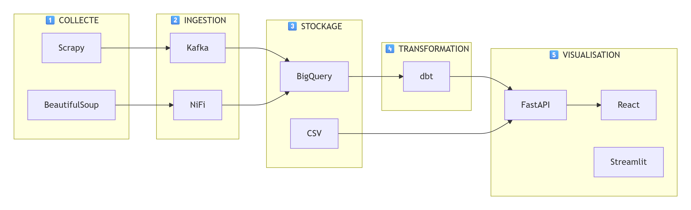

> *Schéma du pipeline de données*

### DAGs Airflow

| DAG | Schedule | Description |
|-----|----------|-------------|
| `daily_catalog_refresh` | `@daily` | Lit les JSON scrappés et les envoie vers Kafka |
| `dbt_run` | `@daily` | Lance `dbt compile` + `dbt run` |
| `data_quality` | `@daily` | Validation via Great Expectations |
| `stats_notebook` | Manuel | Exécution des notebooks d'analyse |

---

## 🧮 Modèles dbt

### Couche Staging — `stg_raw_prices`
Nettoie les types bruts depuis BigQuery :
- Génération d'une clé unique `row_key`
- Cast des types (`FLOAT64`, `TIMESTAMP`, `DATE`)
- Normalisation en minuscules

### Couche Cleaned — `cleaned_prices`
Déduplique et enrichit :
- Déduplication par `(product_url, scraped_at_ts)`
- Nettoyage des prix
- Normalisation des catégories
- Extraction de la marque

### Couche Aggregated

| Modèle | Granularité | Métriques |
|--------|-------------|-----------|
| `agg_daily_prices` | Produit × Jour | avg, min, max, std |
| `agg_weekly_category_stats` | Catégorie × Semaine × Plateforme | stats hebdo, évolution |

---

## 📚 Documentation dbt

Le projet utilise **dbt (data build tool)** pour la transformation et la modélisation des données. La documentation complète des modèles est générée automatiquement.

### 📊 Lineage des données

Le graphique de lineage montre les dépendances entre les modèles, de la source brute jusqu'aux tables agrégées.

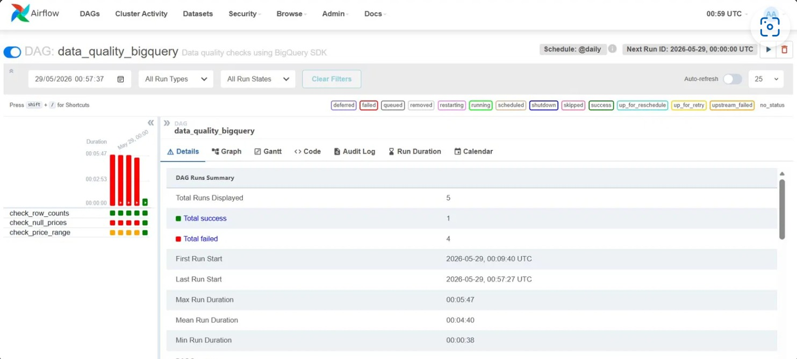

*Graphique de lineage dbt - visualisation des dépendances entre les modèles stg_raw_prices → cleaned_prices → agg_daily_prices*

### 📋 Modèles principaux

| Modèle | Description | Tests |
|--------|-------------|-------|
| **stg_raw_prices** | Nettoyage et typage des données brutes | `not_null`, `unique`, `accepted_values` |
| **cleaned_prices** | Déduplication et enrichissement | `not_null`, `unique` |
| **agg_daily_prices** | Agrégations journalières par produit | `relationships` |
| **agg_weekly_category_stats** | Statistiques hebdomadaires | `dbt_utils.unique_combination_of_columns` |

### 📄 Documentation des colonnes

La table `cleaned_prices` documente l'ensemble des colonnes transformées.

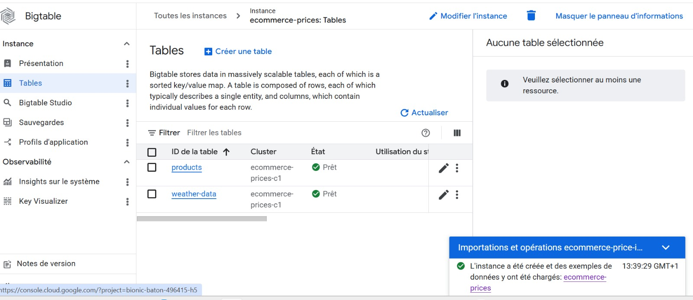

*Documentation dbt - vue des colonnes et descriptions détaillées de la table cleaned_prices*

---

## 🌐 API REST

### Backend principal (`backend/main.py`) — Port **8001**

| Endpoint | Méthode | Description |
|----------|---------|-------------|
| `/api/health` | GET | Santé de l'API |
| `/api/kpis` | GET | KPIs globaux |
| `/api/prices` | GET | Liste des prix avec filtres |
| `/api/stats` | GET | Statistiques descriptives |
| `/api/brands` | GET | Stats par marque |
| `/api/alerts` | GET | Alertes de baisse de prix |
| `/api/price-history` | GET | Historique des prix |
| `/api/price-compare` | GET | Comparaison inter-plateformes |
| `/api/stream/dashboard` | GET | **SSE** — Stream temps réel |
| `/api/generate-alerts` | GET | Génération d'alertes |
| `/api/stats/dynamic` | GET | Stats dynamiques |

> Documentation Swagger : `http://localhost:8001/docs`

---

## 📈 Analyses avancées des prix

### 🔥 Heatmap des prix moyens par plateforme et catégorie

La heatmap ci-dessous visualise les prix moyens (en MAD) pour chaque combinaison plateforme-catégorie.

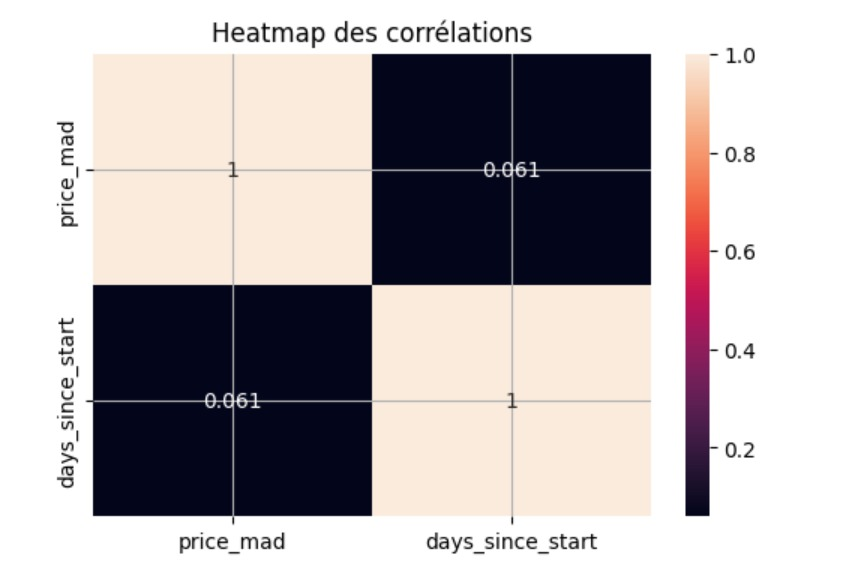

*Cette heatmap montre la corrélation des prix entre les différentes plateformes et catégories. Les couleurs plus claires indiquent les prix les plus élevés.*

### 📊 Distribution réelle des prix

L'analyse de distribution montre comment les prix se répartissent sur chaque plateforme.

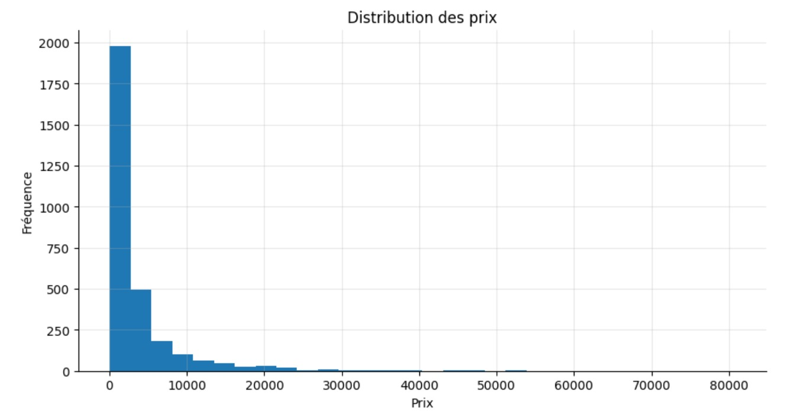

*Box plot représentant la distribution des prix par plateforme. On observe que Jumia présente la plus large gamme de prix, Micromagma se positionne sur le segment premium, Zara maintient des prix homogènes et Marjane occupe une position intermédiaire.*

### 📉 Prix par plateforme

Comparaison des prix moyens par plateforme.

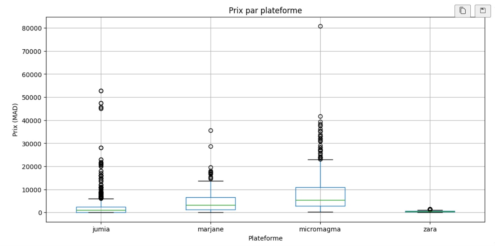

*Graphique comparatif des prix moyens entre Jumia, Marjane, Micromagma et Zara, permettant d'identifier les plateformes les plus compétitives.*

### ⏱️ Évolution temporelle des prix

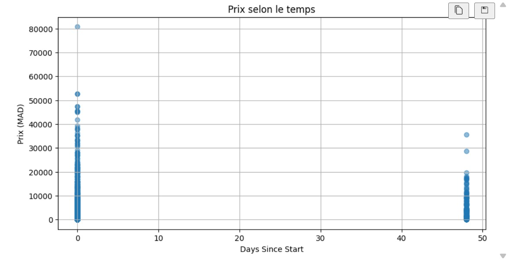

*Évolution des prix dans le temps, montrant les tendances et fluctuations du marché sur la période analysée.*

---

## 📊 Dashboard

Le dashboard React (`frontend/`) expose :

- **KPIs en temps réel** : nombre de produits, alertes actives, prix moyens
- **Comparaison inter-plateformes** : prix moyens par catégorie
- **Historique des prix** : courbes d'évolution temporelle
- **Alertes de baisse** : produits avec réduction significative
- **Statistiques descriptives** : mean, median, min, max, std
- **Analyse par marque** : répartition et positionnement prix

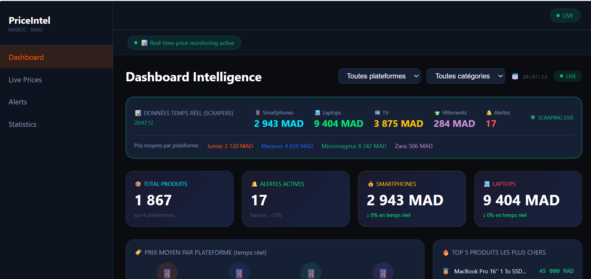
*Interface principale du dashboard avec les KPIs et graphiques interactifs*

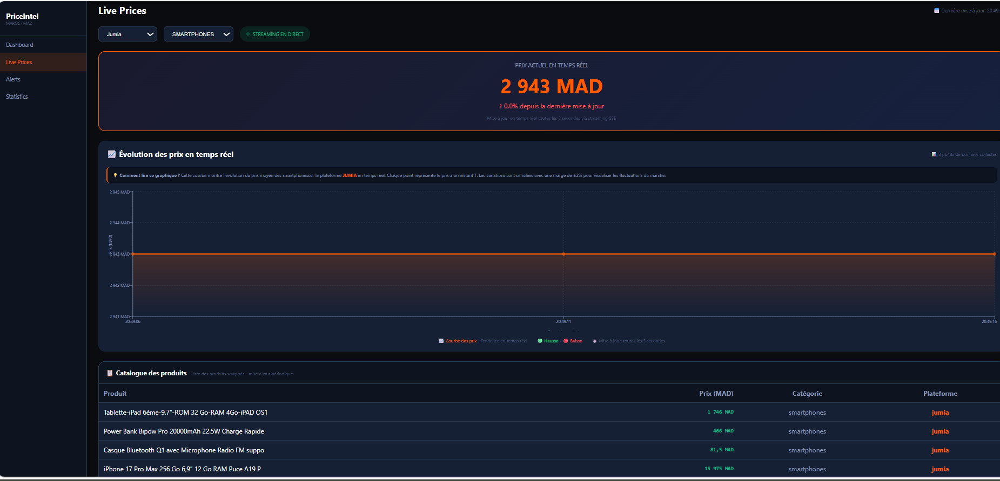
*Page Live Prices - streaming des prix en temps réel avec SSE*

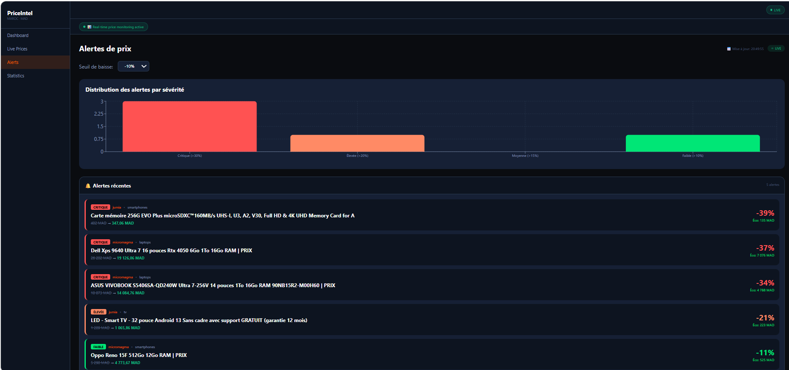
*Page Alertes - détection et visualisation des baisses de prix*

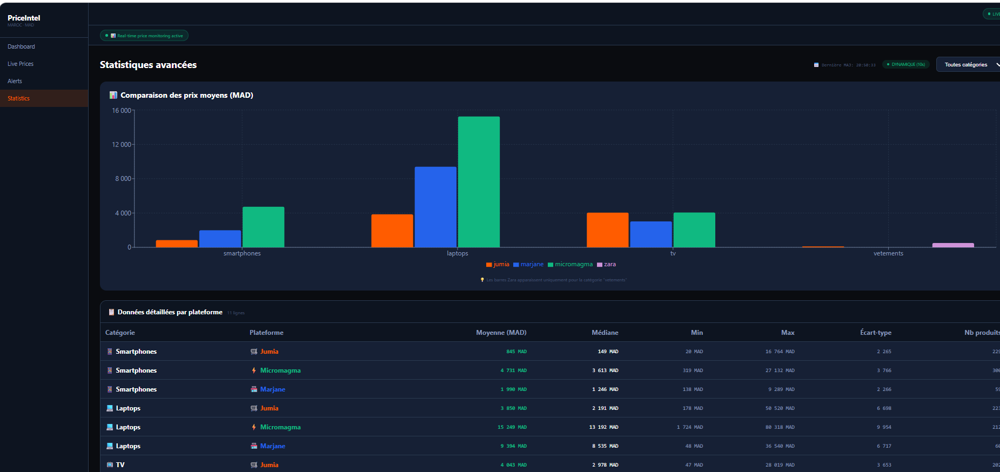
*Page Statistiques - analyses descriptives détaillées*

Accès : `http://localhost:5173`

---

## ☁️ Infrastructure & Déploiement

### Local — Docker Compose

```bash
docker-compose up -d
```

Services démarrés :

| Service | Port | Description |
|---------|------|-------------|
| `zookeeper` | 2181 | Coordination Kafka |
| `kafka` | 9092 | Broker de messages |
| `nifi` | 8080 | Interface Apache NiFi |
| `airflow-webserver` | 8081 | Interface Airflow |
| `airflow-scheduler` | — | Planificateur Airflow |
| `backend` | 8001 | API FastAPI |
| `frontend` | 5173 | Dashboard React |

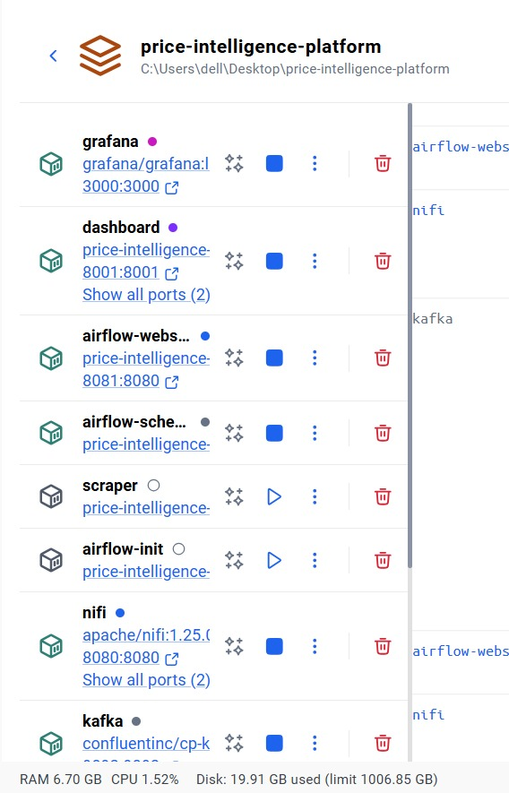
*État des conteneurs Docker - tous les services sont opérationnels*

### Cloud — GCP (Terraform)

```bash
cd infra/terraform
terraform init
terraform apply
```

Ressources provisionnées :
- **Google BigQuery** — Dataset `ecommerce_prices`
- **Google Artifact Registry** — Repository Docker

### Production — Kubernetes

Manifests disponibles dans `infra/k8s/`

---

## ⚙️ CI/CD

Pipeline GitHub Actions (`.github/workflows/ci.yml`) :

```
push/PR → main
    │
    ▼
1. lint        — flake8
    │
    ▼
2. dbt-test    — dbt compile
    │
    ▼
3. docker-push — Build + push des images
```

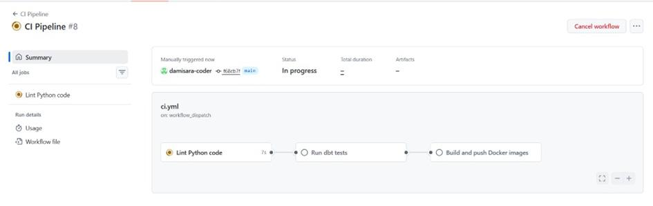

*Pipeline CI/CD GitHub Actions avec toutes les étapes validées en vert*

Secrets requis : `GCP_SA_KEY`, `GCP_PROJECT_ID`

---

## 🚀 Démarrage rapide

### Prérequis

- Docker & Docker Compose
- Python 3.11+
- Node.js 18+
- Compte GCP (optionnel)

### Installation locale

```bash
# 1. Cloner le projet
git clone https://github.com/damisara-coder/price-intelligence-platform.git
cd price-intelligence-platform

# 2. Démarrer les services Docker
docker-compose up -d

# 3. Lancer le backend
cd backend
uvicorn main:app --reload --port 8001

# 4. Lancer le frontend (nouveau terminal)
cd frontend
npm install
npm run dev
```

### Accès aux interfaces

| Service | URL |
|---------|-----|
| Dashboard React | http://localhost:5173 |
| API Swagger | http://localhost:8001/docs |
| Airflow | http://localhost:8081 (admin/admin) |
| NiFi | http://localhost:8080 |
| Grafana | http://localhost:3000 (admin/admin) |
| Prometheus | http://localhost:9090 |

---

## 📦 Données scrappées

Les plateformes couvertes ciblent le marché marocain. Les prix sont en **MAD (Dirham marocain)**. Les catégories normalisées sont :

- `smartphones`
- `laptops`
- `tv`
- `vetements`

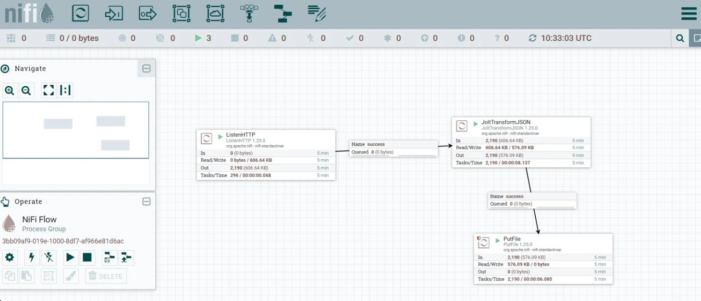

*Pipeline d'ingestion NiFi pour les données scrappées*

---

## 📸 Captures d'écran

### Apache Airflow - Orchestration des pipelines

Airflow gère l'exécution quotidienne des tâches de scraping, transformation et qualité des données.


*Le DAG Airflow avec toutes les tâches vertes, indiquant le succès des exécutions*

### Apache NiFi - Ingestion des données

NiFi assure le streaming et l'ingestion des données en temps réel.


*Le flow NiFi pour l'ingestion et le routage des données*

### Google BigQuery - Entrepôt de données

BigQuery stocke l'ensemble des données transformées et historisées.


*Les données dans BigQuery - aperçu des tables et du volume de données*

---

## 👥 Équipe projet

| Rôle | Nom | Responsabilités |
|------|-----|-----------------|
| **Full Stack Developer** | Hakima fiach | API FastAPI, Frontend React, Dashboard, Streaming SSE |
| **DevOps** | Sara Dami | Docker, CI/CD, Monitoring, Infrastructure |
| **Data Engineer** | Salma Atanan | Scrapers, Kafka, NiFi, Airflow, Bigtable |
| **Data Analyst** | Fatima Najim | dbt models, Statistiques descriptives & inférentielles |

**Semestre 2 - Groupe Data Intelligence**

---

## 🎥 Application demo

📹 **[Télécharger la vidéo de démonstration](demo/demonstra.zip)**

*Télécharge le fichier ZIP, décompresse-le et regarde la démo*

**Fonctionnalités présentées :**
- Navigation dans le dashboard
- Visualisation des prix en streaming (SSE)
- Détection des alertes de baisse
- Filtrage par plateforme et catégorie
- Graphiques interactifs
```

---

